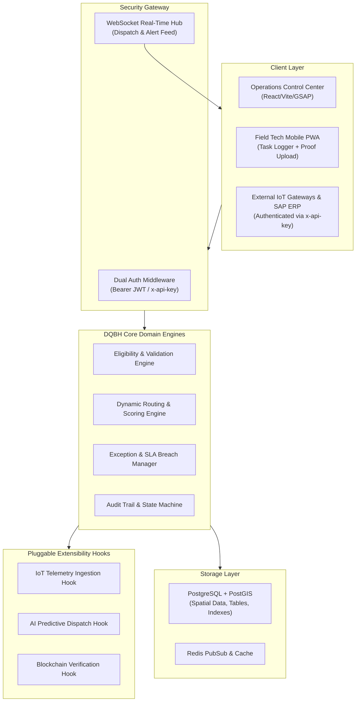

# DQBH: Next-Generation Activity Management Platform for Industrial Equipment Services

[](https://opensource.org/licenses/MIT)
[](https://www.typescriptlang.org/)
[](https://nodejs.org/)
[](https://postgis.net/)
[](https://docker.com)

---

## 🏭 Executive Overview
**DQBH** is an enterprise full-stack digital platform engineered to orchestrate the entire lifecycle of industrial equipment service and maintenance operations across multi-site manufacturing, energy, and cleanroom facilities.

### Core Problems Solved:
1. **Spreadsheet & Radio Fragmentation**: Centralizes all work orders, asset digital twins, technician telemetry, and spare parts.
2. **SLA Breaches & Technician Dropouts**: Real-time exception watchdog with automatic re-routing cascades using multi-factor Haversine geo-scoring.
3. **Manual Verification & Audit Opacity**: Field mobile PWA with mandatory photo evidence capture, digital signatures, and cryptographic blockchain audit seals.
4. **Third-Party & IoT Ingestion**: Native API Key management engine with `x-api-key` header authentication, SHA-256 secret hashing, and granular role scopes.

---

## 📐 High-Level Architecture



---

## ⚡ Quickstart Guide

### Option 1: Full Docker Compose Deployment (Production PostgreSQL + Redis + App)
```bash
# 1. Clone repository and navigate to project root
cd dqbh-platform

# 2. Launch all services
docker compose up --build -d

# 3. Access interfaces:
# - Frontend Workspace Console: http://localhost:3000
# - Backend REST API:           http://localhost:5000/api/v1
# - Real-time WebSocket Hub:    ws://localhost:5000/ws
```

### Option 2: Standalone Local Development (Zero Database Prerequisites)
The backend includes a high-fidelity synchronized in-memory store pre-seeded with multi-site industrial assets.

```bash
# Terminal 1: Start Backend API & WebSocket Hub
cd backend
npm install
npm run dev

# Terminal 2: Start Frontend UI & Live Simulator
cd ../frontend
npm install
npm run dev
```

---

## 🔑 API Key Provisioning & External Ingestion

DQBH provides first-class API Key management for external ERPs, automated SCADA systems, and IoT sensor gateways.

### 1. Generating an API Key
Send a request to `/api/v1/api-keys` or use the in-app **API Key Manager**:
```bash
curl -X POST http://localhost:5000/api/v1/api-keys \
  -H "Content-Type: application/json" \
  -d '{
    "name": "Houston Refinery SCADA Ingestion Gateway",
    "role": "OPERATIONS_MANAGER",
    "scopes": ["iot:telemetry:write", "requests:read", "requests:write"],
    "rateLimitRpm": 300
  }'
```

### 2. Ingesting IoT Sensor Telemetry via `x-api-key`
```bash
curl -X POST http://localhost:5000/api/v1/integrations/iot/telemetry \
  -H "Content-Type: application/json" \
  -H "x-api-key: dqbh_live_9988_a1b2c3d4e5f6" \
  -d '{
    "machineSerialNumber": "TURB-9HA-90812",
    "sensorData": {
      "vibrationMmPerSec": 8.4,
      "temperatureCelsius": 99.2,
      "oilPressurePsi": 52.0,
      "acousticRpm": 3600,
      "powerKw": 571000
    }
  }'
```
*Note: Exceeding 7.5 mm/s vibration or 95°C temperature automatically raises a validated emergency ticket and dispatches the closest certified field technician.*

---

## 📁 Repository Structure

```
dqbh-platform/
├── backend/
│   ├── src/
│   │   ├── config/index.ts              # Runtime configuration & port bindings
│   │   ├── domain/
│   │   │   ├── types.ts                 # Domain models, Enums, DTOs
│   │   │   └── stateMachine.ts          # Finite state machine transitions
│   │   ├── db/
│   │   │   ├── schema.sql               # Production PostgreSQL + PostGIS DDL
│   │   │   ├── seed.sql                 # Industrial assets, technicians & parts
│   │   │   └── memoryStore.ts           # Synchronized zero-dependency store
│   │   ├── services/
│   │   │   ├── validationEngine.ts      # Machine eligibility & parts reservation
│   │   │   ├── routingEngine.ts         # Haversine geo-distance & skill matcher
│   │   │   ├── exceptionEngine.ts       # Dropout recovery & SLA auto-rerouting
│   │   │   ├── apiKeyService.ts         # SHA-256 hashed API key engine & limiter
│   │   │   └── eventPipeline.ts         # Pluggable IoT, AI & Blockchain hooks
│   │   ├── middleware/auth.ts           # Dual JWT + x-api-key RBAC middleware
│   │   ├── routes/                      # REST API domain routers
│   │   ├── sockets/socketManager.ts     # Real-time WebSocket hub
│   │   └── index.ts                     # Main Express server bootstrap
│   ├── package.json
│   ├── tsconfig.json
│   └── Dockerfile
├── frontend/
│   ├── src/
│   │   ├── app.js                       # GSAP chapter scroll & interactive console
│   │   └── styles.css                   # Editorial design system & mono layout
│   ├── index.html                       # Multi-role interactive web console
│   ├── vite.config.ts
│   ├── package.json
│   └── Dockerfile
├── docs/
│   ├── ARCHITECTURE.md                  # Comprehensive domain architecture
│   └── API.md                           # OpenAPI & WebSocket reference
├── docker-compose.yml                   # Container orchestration
└── package-project.ps1                  # Single-click ZIP packaging script
```

---

## 🛡️ License
Distributed under the MIT Enterprise Open Source License.
