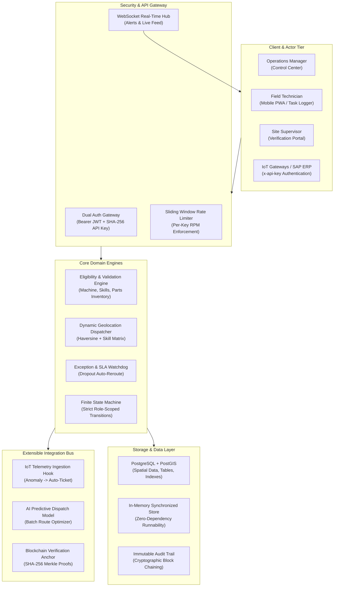
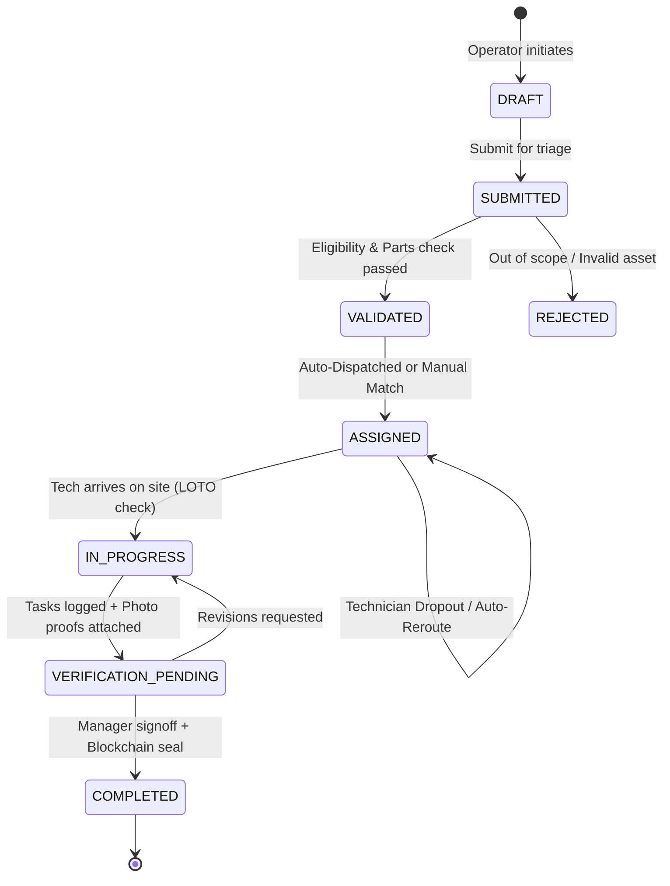

# DQBH: Next-Generation Activity Management Platform for Industrial Equipment Services
## Enterprise Architecture & Technical Specification

---

### 1. Architectural Philosophy & Decoupled Domain Design
The **DQBH** platform orchestrates high-stakes industrial equipment service lifecycles across geographically distributed facilities (energy plants, automotive assembly hubs, semiconductor cleanrooms).

---

### 2. Service Request Lifecycle State Machine

---

### 3. Dynamic Routing & Multi-Factor Scoring Algorithm
Technician dispatch evaluates all active technicians using a weighted multi-factor composite algorithm:

$$\text{Composite Score} = 0.40 \cdot \text{GeoScore} + 0.35 \cdot \text{SkillScore} + 0.15 \cdot \text{WorkloadScore} + 0.10 \cdot \text{RatingScore}$$

Where:
1. **Geo-Proximity Score**:
   $$d = 2 R \arcsin\left(\sqrt{\sin^2\left(\frac{\Delta \phi}{2}\right) + \cos(\phi_1)\cos(\phi_2)\sin^2\left(\frac{\Delta \lambda}{2}\right)}\right)$$
   $$\text{GeoScore} = \max\left(0, 100 \cdot \left(1 - \frac{d}{d_{\text{max}}}\right)\right) \quad (\text{with } d_{\text{max}} = 250\text{ km})$$
2. **Skill Certification Compatibility**:
   $$\text{SkillScore} = \frac{|\text{Technician Certifications} \cap \text{Required Skills}|}{|\text{Required Skills}|} \times 100$$
3. **Workload Availability Factor**:
   $$\text{WorkloadScore} = \frac{\text{Capacity Remaining}}{\text{Max Concurrent Jobs}} \times 100$$
4. **Historical Service Quality Rating**:
   $$\text{RatingScore} = \frac{\text{Service Rating}}{5.0} \times 100$$

---

### 4. Automated Dropout & SLA Recovery Cascade
When an assigned technician drops out or is disabled:
1. **Capacity Release**: Active job count is immediately decremented on the dropped technician.
2. **Lock Preservation**: Reserved spare parts remain allocated to the ticket.
3. **Instant Candidate Re-Ranking**: The routing engine runs an exclusion filter (`technician.id != dropped_tech_id`) to find the next highest ranking candidate.
4. **Auto-Assignment & Alert**: If a replacement is found, state remains `ASSIGNED` with the new candidate and a WebSocket alert is broadcast to operations.

---

### 5. API Key Management & Cryptographic Security
External systems authenticate via the `x-api-key` header:
- **Entropy**: 192-bit cryptographically secure random entropy (`dqbh_live_<prefix>_<secret>`).
- **Storage**: Plaintext keys are never stored; only SHA-256 hashes are persisted in the database.
- **Role-Scoped Grants**: Fine-grained scopes (`iot:telemetry:write`, `requests:read`, `requests:write`, `dispatch:admin`).
- **Rate Limiting**: Sliding 60-second window enforcing per-key RPM thresholds.
